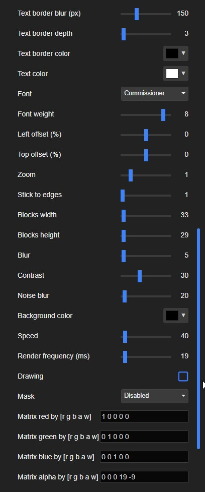

# Wallpaper based on [mirzaev/womb3-simplex.js](https://git.mirzaev.sexy/mirzaev/womb3-simplex.js) for [Wallpaper Engine](https://steamcommunity.com/app/431960)

Powerful wallpaper maker! Generation in real time!
You can edit 43 parameters, including the color math matrix!

It is free to install from the [Steam Workshop](https://steamcommunity.com/sharedfiles/filedetails/?id=3087430455), have fun.

  
  

## Examples
  
  
  
  
  
  

## Trailer
Click on the cover image below to view the video (it in in the `/videos` folder)  
